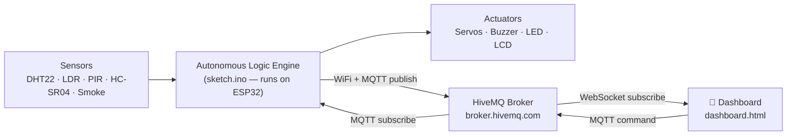
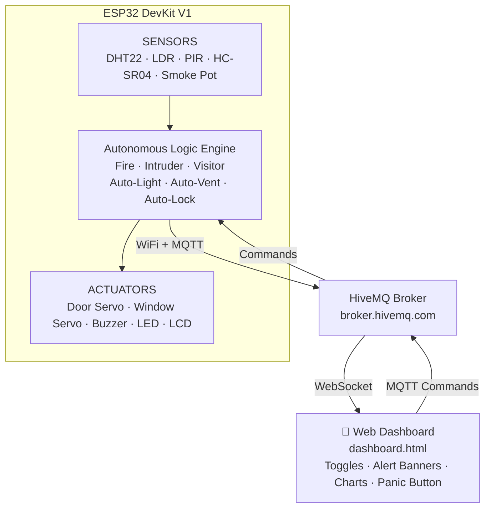

# Smart Hub: Home Automation — Technical Manual

> **Smart Hub: Home Automation** is an ESP32-powered IoT system that combines environmental sensing, autonomous safety protocols, and MQTT-based remote control into a unified smart home platform. The ESP32 runs the complete decision logic independently; the mobile web dashboard provides real-time telemetry and manual overrides from anywhere in the world. The entire system is simulated on [Wokwi](https://wokwi.com) — no physical hardware is required.

---

## Table of Contents

1. [How It Works — The Big Picture](#how-it-works--the-big-picture)
2. [System Architecture](#system-architecture)
3. [Hardware Reference](#hardware-reference)
4. [Pin Mapping](#pin-mapping)
5. [Autonomous Logic Engine](#autonomous-logic-engine)
6. [Safety Protocol Priority System](#safety-protocol-priority-system)
7. [MQTT Communication Protocol](#mqtt-communication-protocol)
8. [Web Dashboard](#web-dashboard)
9. [Full Scenario Walkthroughs](#full-scenario-walkthroughs)
10. [Project Structure](#project-structure)
11. [Technology Stack](#technology-stack)
12. [Project Summary](#project-summary)

---

## How It Works — The Big Picture



<details>
<summary>ASCII fallback (click to expand)</summary>

```
Sensors ──► Autonomous Logic Engine ──► Actuators
               (sketch.ino)                │
                    │                      │
               WiFi + MQTT                 │
                    │                      │
            ┌───────▼────────┐             │
            │  HiveMQ Broker │             │
            └───────┬────────┘             │
                    │                      │
            ┌───────▼────────┐             │
            │  📱 Dashboard  │◄────────────┘
            │  dashboard.html│  MQTT command
            └────────────────┘
```

</details>

---

## System Architecture



<details>
<summary>ASCII fallback (click to expand)</summary>

```
┌──────────────────────────────────────────────────────────────┐
│                     ESP32 DevKit V1                          │
│                                                              │
│  SENSORS (Input)                    ACTUATORS (Output)       │
│  ┌────────────┐                     ┌──────────────┐         │
│  │ DHT22      │ Temp + Humidity     │ Door Servo   │ Lock    │
│  │ LDR        │ Light Level         │ Window Servo │ Vent    │
│  │ PIR        │ Motion              │ Buzzer       │ Alarm   │
│  │ HC-SR04    │ Distance            │ LED          │ Strobe  │
│  │ Smoke Pot  │ Gas/AQI             │ LCD 1602     │ Status  │
│  └─────┬──────┘                     └──────┬───────┘         │
│        │                                   │                 │
│  ┌─────▼───────────────────────────────────▼──────────┐      │
│  │              Autonomous Logic Engine               │      │
│  │  • Fire: smoke>2000 || temp>50 → alarm + vent      │      │
│  │  • Intruder: armed && (PIR || dist<50) → siren     │      │
│  │  • Visitor: dist<100 for >5s → notify              │      │
│  │  • Auto-light: LDR>2000 → LED on                   │      │
│  │  • Auto-vent: AQI>40 → window open                 │      │
│  │  • Auto-lock: 30s after unlock → re-arm            │      │
│  └─────────────────────┬──────────────────────────────┘      │
│                   WiFi + MQTT                                │
└────────────────────────┼─────────────────────────────────────┘
              ┌──────────▼──────────┐
              │  HiveMQ Broker      │
              └──────────┬──────────┘
              ┌──────────▼──────────┐
              │  📱 Web Dashboard   │
              └─────────────────────┘
```

</details>

---

## Hardware Reference

### Controller

| Component | Role |
|---|---|
| **ESP32 DevKit V1** | Central processing — WiFi, MQTT, sensor reading, actuator control |

### Environmental Sensors

| Sensor | GPIO | Function |
|---|---|---|
| **DHT22** | 15 | Temperature + humidity; fire if temp > 50°C |
| **Potentiometer** (Smoke sim.) | 32 | Gas/smoke level → AQI 0–100 |
| **LDR (Photoresistor)** | 34 | Ambient light → auto-lighting threshold |

### Security Sensors

| Sensor | GPIO | Function |
|---|---|---|
| **PIR Motion Sensor** | 13 | Infrared heat detection — primary intruder trigger |
| **HC-SR04 Ultrasonic** | Trig: 5 · Echo: 18 | Distance measurement — visitor detection + door perimeter |

### Actuators

| Actuator | GPIO | Function |
|---|---|---|
| **Servo 1** (Door Lock) | 4 | 0°–90° PWM — lock/unlock simulation |
| **Servo 2** (Window) | 14 | 0°–90° PWM — ventilation control |
| **Active Buzzer** | 2 | Fire: 2kHz · Intruder: 1kHz · Panic: alternating 1.5kHz/3kHz |
| **Blue LED** | 16 | Night light + emergency strobe |
| **LCD 1602 (I2C)** | SDA: 21 · SCL: 22 | On-device status display |

---

## Pin Mapping

| Component | Pin | Type |
|---|---|---|
| DHT22 | 15 | Digital Data |
| PIR | 13 | Digital Input |
| LDR | 34 | Analog Input |
| Smoke Sensor | 32 | Analog Input |
| Ultrasonic Trig | 5 | Digital Output |
| Ultrasonic Echo | 18 | Digital Input |
| Buzzer | 2 | Digital Output |
| Blue LED | 16 | Digital Output |
| Door Servo | 4 | PWM |
| Window Servo | 14 | PWM |
| LCD SDA | 21 | I2C |
| LCD SCL | 22 | I2C |

---

## Autonomous Logic Engine

The firmware (`sketch.ino`) runs a polling loop every ~500ms. Each iteration:

1. Reads all sensors
2. Evaluates six autonomous rules (in priority order)
3. Publishes telemetry + status to MQTT
4. Processes any incoming MQTT commands

### Six Autonomous Rules

| Rule | Trigger Condition | Action |
|---|---|---|
| **Fire** | `smoke > 2000` OR `temp > 50°C` | Sound buzzer (2kHz), open window servo (ventilate), flash LED, display "FIRE!" |
| **Intruder** | `armed == true` AND (`PIR == HIGH` OR `distance < 50cm`) | Sound buzzer (1kHz), lock door, display "INTRUDER!" |
| **Visitor** | `distance < 100cm` for more than 5 consecutive seconds | Publish visitor alert to dashboard (non-alarm notification) |
| **Auto-Light** | `LDR > 2000` (dark ambient) | Turn LED on; turn off when LDR drops below threshold |
| **Auto-Vent** | `AQI > 40` (poor air) | Open window servo; close when AQI clears |
| **Auto-Lock** | 30 seconds elapsed after manual dashboard unlock | Re-lock door servo and re-arm security system |

### Manual Override Behaviour

When a user manually toggles a device from the dashboard, the auto-mode flag for that device is cleared. The device will not be overridden by automation until the user explicitly re-enables "Auto Mode" for that device.

---

## Safety Protocol Priority System

| Priority | Protocol | Condition |
|---|---|---|
| **1 (Highest)** | Panic Mode | Dashboard panic button pressed |
| **2** | Fire Alert | smoke > 2000 OR temp > 50°C |
| **3** | Intruder Alert | System armed + sensor trigger |
| **4 (Lowest)** | Environmental Automation | LDR / AQI thresholds |

Lower-priority states cannot override higher-priority outputs. For example, if Panic Mode is active, the buzzer runs the panic pattern regardless of fire or intruder state.

---

## MQTT Communication Protocol

**Broker:** HiveMQ Public — `broker.hivemq.com`
- **ESP32 → Broker:** TCP port 1883
- **Dashboard → Broker:** WebSocket (WSS) port 8884

### Topics

| Topic | Direction | Payload Format |
|---|---|---|
| `yaksh/smarthub/telemetry` | ESP32 → Dashboard | JSON: `temp`, `hum`, `intruder`, `fire`, `smoke`, `visitor`, `aqi`, `window`, `intruderMuted`, `fireMuted` |
| `yaksh/smarthub/status` | ESP32 → Dashboard | JSON: `armed`, `light`, `window`, `buzzerMuted`, `fireMuted`, `panic` |
| `yaksh/smarthub/command` | Dashboard → ESP32 | Plain string command |

### Command Reference

| Command | Action |
|---|---|
| `ARM` / `DISARM` | Arm/disarm security; lock/unlock door servo |
| `LIGHT_ON` / `LIGHT_OFF` | Manual light control; clears auto-light mode |
| `AUTO_LIGHT` | Re-enable LDR-based auto-lighting |
| `WINDOW_OPEN` / `WINDOW_CLOSE` | Manual window control; clears auto-vent mode |
| `AUTO_WINDOW` | Re-enable AQI-based auto-ventilation |
| `PANIC_ON` / `PANIC_OFF` | Activate/deactivate panic mode |
| `MUTE_FIRE` | Silence fire alarm; auto-resets when fire condition clears |
| `MUTE_INTRUDER` | Silence intruder alarm; auto-resets when breach clears |

---

## Web Dashboard

`dashboard.html` is a single-file, mobile-first web app — no build step, no dependencies beyond Chart.js (CDN).

### Dashboard Sections

| Section | Description |
|---|---|
| **Panic Button** | Full-width pulsing red button; sends `PANIC_ON` / `PANIC_OFF` |
| **Security Card** | Armed/Open badge; arm toggle; auto-lock countdown timer |
| **Light Card** | ON/OFF toggle; "Auto-light (LDR)" checkbox |
| **Window Card** | Open/Close toggle; "Auto-ventilation" checkbox |
| **Environment Card** | Live temp, humidity, AQI with color-coded health label (Clean / Moderate / POOR) |
| **Live Chart** | Chart.js rolling 20-point line graph for temp, humidity, and smoke |
| **Alert Banners** | Fire (flashing orange), Intruder (red), Visitor (blue) — each with an inline mute link |

### MQTT Connection (Dashboard Side)

```js
const client = mqtt.connect('wss://broker.hivemq.com:8884/mqtt')
client.subscribe(['yaksh/smarthub/telemetry', 'yaksh/smarthub/status'])
client.on('message', (topic, payload) => {
  const data = JSON.parse(payload)
  // update UI elements
})
```

---

## Full Scenario Walkthroughs

### Scenario 1 — Fire Detection

1. Wokwi: increase smoke potentiometer above threshold (raw > 2000)
2. ESP32 logic detects `smoke > 2000`
3. Buzzer activates at 2kHz, window servo opens to 90°, LED strobes
4. LCD displays `FIRE!`
5. Telemetry publishes `fire: true` to MQTT
6. Dashboard shows flashing orange **FIRE** alert banner
7. User clicks "Mute Fire" → command `MUTE_FIRE` sent → buzzer silences
8. When smoke drops below 2000, alert clears automatically; mute resets

### Scenario 2 — Intruder Detection

1. Dashboard: arm the security system (`ARM` command)
2. Wokwi: click PIR sensor to trigger motion
3. ESP32: `armed == true` + `PIR == HIGH` → intruder alert
4. Buzzer activates at 1kHz, door servo locks to 0°
5. Dashboard shows red **INTRUDER** banner
6. User disarms from dashboard: door unlocks, 30-second auto-relock timer starts
7. After 30s: door re-locks, system re-arms automatically

### Scenario 3 — Visitor Detection

1. Wokwi: position HC-SR04 distance at < 100cm
2. Firmware starts 5-second dwell timer
3. After 5 continuous seconds: visitor alert published
4. Dashboard shows blue **VISITOR** notification banner (not an alarm)
5. No actuators triggered; system remains in normal state

### Scenario 4 — Remote Control from Dashboard

1. Open `dashboard.html` in browser (or deployed Vercel URL)
2. Dashboard auto-connects via WebSocket
3. Toggle **Light ON** → command `LIGHT_ON` sent → LED activates on ESP32
4. Un-check "Auto-light (LDR)" checkbox to disable LDR automation for this device
5. Check again to restore `AUTO_LIGHT` mode

---

## Project Structure

```
smart-hub/
├── sketch.ino           # ESP32 Arduino firmware (229 lines)
│                        #   Sensor reading, autonomous logic, MQTT pub/sub
├── dashboard.html       # Mobile-first web dashboard (438 lines)
│                        #   MQTT over WebSocket, Chart.js, toggle controls
├── diagram.json         # Wokwi circuit schematic (all components + wiring)
├── libraries.txt        # Arduino library dependencies for Wokwi
├── vercel.json          # Vercel deployment config
├── wokwi-project.txt    # Wokwi simulation link
├── summary.md           # Component-by-component hardware reference
├── README.md            # Project overview and quick start
└── SmartHub.md          # This document — full technical manual
```

---

## Technology Stack

| Technology | Purpose |
|---|---|
| **ESP32 DevKit V1** | Main controller — dual-core 240MHz, built-in WiFi |
| **Arduino C++ (Arduino IDE)** | Firmware language for `sketch.ino` |
| **PubSubClient** | Arduino MQTT library — publishes telemetry + subscribes to commands |
| **DHT sensor library** | DHT22 driver |
| **ESP32Servo** | PWM servo control |
| **LiquidCrystal_I2C** | LCD 1602 driver over I2C |
| **HiveMQ Public Broker** | Free MQTT broker (TCP 1883 / WSS 8884) |
| **MQTT.js (CDN)** | JavaScript MQTT client in dashboard (WebSocket) |
| **Chart.js (CDN)** | Rolling live chart in dashboard |
| **Vercel** | Optional static hosting for `dashboard.html` |
| **Wokwi** | Full ESP32 + circuit simulation (no physical hardware needed) |

---

## Project Summary

| Attribute | Value |
|---|---|
| **Type** | Embedded IoT system + web dashboard |
| **Controller** | ESP32 DevKit V1 |
| **Firmware** | Arduino C++ (sketch.ino) |
| **Dashboard** | Single-file HTML/JS (no build step) |
| **Protocol** | MQTT over TCP (ESP32) + WebSocket/SSL (browser) |
| **Broker** | HiveMQ Public — `broker.hivemq.com` |
| **Simulation** | Wokwi — [project link](https://wokwi.com/projects/462033205041634305) |
| **Deployment** | Dashboard deployable to Vercel |
| **Sensors** | 5 (DHT22, LDR, PIR, HC-SR04, Smoke Pot) |
| **Actuators** | 5 (Door Servo, Window Servo, Buzzer, LED, LCD) |
| **Autonomous rules** | 6 (Fire, Intruder, Visitor, Auto-Light, Auto-Vent, Auto-Lock) |
| **MQTT commands** | 10 |
